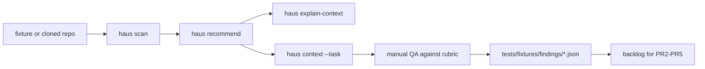

# Product Validation

Repeatable QA workflow for Haus recommendation + context quality.

## Scope policy

```txt
Synthetic fixture QA is required.
External clone QA is documented and best-effort.
Internal repo QA is manual/user-run only and never required for CI or PR acceptance.
```

## Why this exists

The recommender (`haus recommend`) and the task-context router (`haus context --task`) are the product. This doc defines how we observe their behavior on realistic inputs and capture every miss as a structured finding for later calibration (PR2-PR5).

## Validation loop



## Setup

### Build the CLI

```bash
yarn build
```

The fixture runner invokes `node dist/cli.js`. Synthetic QA does not require global install.

### Synthetic fixtures (required)

Committed under [tests/fixtures/repos/](../tests/fixtures/repos/):

- `vendure-monorepo`
- `nextjs-app`
- `nest-graphql-api`
- `laravel-app`
- `wordpress-bedrock-site`
- `turbo-monorepo`
- `nx-workspace`
- `laravel-with-react-frontend` (mixed)
- `vendure-with-nextjs-storefront` (mixed)
- `orphan-graphql-config` (mixed)
- `wordpress-with-node-tooling` (mixed)

### External clones (best-effort)

Clone to `~/haus-validation/` (untracked, never committed). Suggested upstream targets:

| Ecosystem | Upstream |
|-----------|---------|
| Vendure   | https://github.com/vendure-ecommerce/vendure |
| Next.js   | https://github.com/vercel/next.js/tree/canary/examples |
| NestJS GQL | https://github.com/nestjs/graphql |
| Laravel   | https://github.com/laravel/laravel |
| WordPress | https://github.com/roots/bedrock |

Skip silently if the clone fails or upstream is unreachable. External findings are informational.

### Internal repos (manual)

Run by hand against real internal repos. Never commit paths, snapshots, or findings derived from internal source.

## Per-target script

```bash
cd <repo-or-fixture>
node /path/to/haus-workflow/dist/cli.js scan --json > /tmp/scan.json
node /path/to/haus-workflow/dist/cli.js recommend --json > /tmp/rec.json
node /path/to/haus-workflow/dist/cli.js explain-context --json > /tmp/explain.json
node /path/to/haus-workflow/dist/cli.js context --task "<task>" --json > /tmp/ctx.json
```

Then evaluate the four outputs against the rubric below.

## Realistic tasks per ecosystem

Run each `context --task` for the matching ecosystem:

- **Vendure**: `build shipping plugin`, `add admin ui extension`, `create graphql resolver`
- **Next.js**: `build dashboard route`, `add tanstack query mutation`
- **NestJS**: `add graphql resolver with auth guard`
- **Laravel**: `create nova resource`, `add queue job`
- **WordPress**: `add custom block`

## Scoring rubric

Each axis scored 0-3 (`0` = broken, `3` = perfect):

| Axis | What to check |
|------|---------------|
| **selection correctness** | Are the right rules in `recommended[]`? |
| **skip precision**        | Are any genuinely useful rules in `skipped[]`? |
| **stack isolation**       | Does cross-ecosystem bleed appear (e.g. `tailwind` in a backend-only repo)? |
| **confidence honesty**    | Is `confidenceLevel: "high"` reserved for strong multi-signal matches? |
| **context minimality**    | Does `haus context --task` exclude unrelated ecosystems/testing frameworks? |
| **explain readability**   | Are reasons/skip-reasons human-meaningful? |

A score of `<= 2` on any axis triggers a finding.

## Findings

Every QA target produces at least one record in [tests/fixtures/findings/](../tests/fixtures/findings/). Two shapes:

### Issue record

```json
{
  "id": "vendure-frontend-bleed-001",
  "repo": "vendure-monorepo",
  "status": "issue",
  "command": "haus context --task \"build shipping plugin\"",
  "issue": "haus.tailwind-scss-patterns selected during backend plugin task",
  "expected": "only vendure-plugin, nestjs-graphql, package-manager rules",
  "actual": ["haus.vendure-plugin-patterns", "haus.tailwind-scss-patterns", "haus.react19-patterns"],
  "severity": "medium",
  "rootCauseHypothesis": "stack-match fires on tags 'react' present via root-level package.json devDeps",
  "proposedFixPR": "PR2|PR3"
}
```

Severity scale: `low | medium | high | critical`.

`proposedFixPR` routes the finding into the right follow-up:

- **PR2** scoring calibration (`src/recommender/recommend.ts`)
- **PR3** context payload precision (`src/commands/context.ts`)
- **PR4** explain readability (`src/commands/explain-context.ts`, `src/commands/explain-recommendation.ts`)
- **PR5** regression hardening (`tests/golden/`)

### Clean record

When a target has zero findings:

```json
{
  "id": "nextjs-app-clean-001",
  "repo": "nextjs-app",
  "status": "clean",
  "commands": [
    "haus scan --json",
    "haus recommend --json",
    "haus context --task \"build dashboard route\" --json"
  ],
  "notes": "No recommendation or context-quality issues found during fixture QA."
}
```

## Validating the findings directory

```bash
yarn tsx scripts/validate-findings.ts
```

The script asserts required fields per record shape. It does not fail CI; it is informational.

## Acceptance gate

**Required for PR acceptance:**

- Every synthetic fixture has at least one record in `tests/fixtures/findings/` (issue or clean).
- `scripts/validate-findings.ts` runs green.

**Not required:**

- External clone QA (best-effort).
- Internal real-repo QA (manual only).

## PR3: Task-intent context filter

`haus context --task` classifies the task string into one or more deterministic
intents and filters the already-recommended set. It never re-runs scoring and
never widens the recommended set.

Intents: `backend`, `frontend`, `admin-ui`, `storefront`, `graphql`, `database`,
`auth`, `testing`, `docs`, `monorepo`.

Filtering order:

1. **No task** -> return `recommended[]` unchanged.
2. **Task with classified intents** -> keep only rules whose `tags`+`ecosystem`
   intents intersect the task intents. Baselines are excluded.
3. **Ambiguous task** (no intents matched) -> token-keyword fallback against rule
   id/tags/ecosystem/reasons. Baselines excluded.
4. **Still empty** -> non-baseline medium/high recommendations, capped at 8.
   Testing-only rules are excluded unless the task itself is testing-related.

Each `context --json` payload now includes the resolved `taskIntents` array for
auditability.

Goldens live in [tests/golden/context/](../tests/golden/context/) and are
driven by `tests/context-goldens.test.js`. Each fixture+task entry asserts
expected intents, required selected IDs, forbidden IDs, and absence of baseline
rules where applicable.

## PR4: Explainability polish

`haus explain-recommendation` and `haus explain-context` are pure renderers
over `.haus-ai/recommendation.json`. They never re-run scoring, never call the
catalog, and never widen/narrow the recommended set.

`explain-recommendation` human output groups `Selected` and `Skipped`, with per
rule `confidence`, `selection`, and indented `why:` bullets that include the
underlying signal (e.g. `stack/dependency match (tag:nestjs)`).

`explain-context --task "<task>"` adds:

- `Task intents` (deterministic classifier output from PR3)
- `Task signals` (well-known ecosystem/stack tokens spotted in the task text)
- `Repo signals matched` (ecosystem + tags of rules that survived the task
  filter)
- `Included in task context` (per rule: confidence, selection, intents, the
  human reason for inclusion, and the original recommender why-bullets)
- `Excluded from task context` (per rule: intents and the human reason for
  exclusion, e.g. baseline isolation or intent mismatch)

JSON additions are optional, additive fields only (`task`, `taskIntents`,
`taskSignals`, `repoSignals`, `includedInTask`, `excludedFromTask`). The legacy
`selected`, `skipped`, `stats` keys remain byte-stable for callers that already
consume the JSON.
