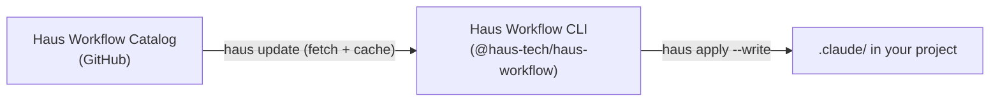

<!-- SITE SHELL: edit this file for @site/ components; synced prose lives in haus-workflow/docusaurus-docs/ -->

# Haus Workflow

**Haus Workflow** (`@haus-tech/haus-workflow`) is Haus Tech's open-source CLI for agentic development. It scans your repository, recommends AI context assets from the [Haus Workflow Catalog](./catalog), and writes controlled outputs into `.claude/` and `.haus-workflow/`.

:::note Open-source, internally maintained
Haus Workflow is open-source under MIT. It is maintained exclusively by the Haus Tech team — external issues, PRs, and roadmap requests are not accepted.
:::

## What it does

| Step      | Command              | Output                   |
| :-------- | :------------------- | :----------------------- |
| Scan      | `haus scan`          | `context-map.json`       |
| Recommend | `haus recommend`     | `recommendation.json`    |
| Apply     | `haus apply --write` | `.claude/` assets        |
| Update    | `haus update`        | Latest catalog + refresh |

## How it fits together



## Install

```bash
npm install -g @haus-tech/haus-workflow
```

A global install auto-runs `haus install`, which seeds `~/.claude/` with the Haus Workflow skill and slash commands.

## Claude Code integration

After install, use `/haus-workflow` in Claude Code for project setup, health checks, and catalog updates — no terminal required for day-to-day tasks.

→ See **[Claude Code in Action](./claude-code-guide)** for illustrated chat examples.

## Documentation

- [Getting started](./getting-started)
- [Claude Code in Action](./claude-code-guide)
- [CLI commands](./commands)
- [Slash commands](./slash-commands)
- [Architecture](./architecture)
- [Haus Workflow Catalog](./catalog) — skills, agents, templates (94 items)

## Source

[github.com/WeAreHausTech/haus-workflow](https://github.com/WeAreHausTech/haus-workflow)
