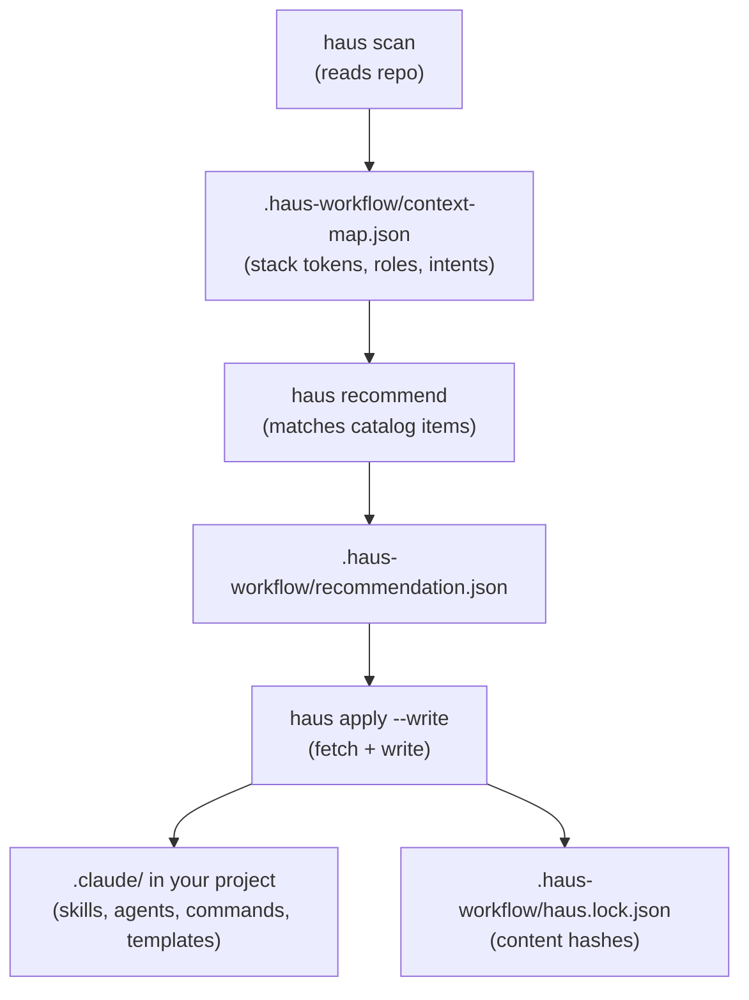
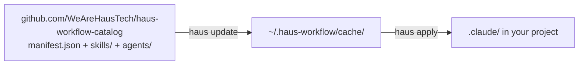

# Architecture

## The scan → recommend → apply pipeline

## Catalog fetch

Catalog items are **not** bundled into the npm package. They are fetched at runtime from [haus-workflow-catalog](https://github.com/WeAreHausTech/haus-workflow-catalog) and cached locally.

## Output ownership

haus-workflow writes exclusively to `.claude/` and `.haus-workflow/`. It never modifies application source code, package.json, or CI configuration.

Hand-edits inside haus-managed blocks (`<!-- HAUS:BEGIN … -->` … `<!-- HAUS:END … -->`) are overwritten on next `haus apply`. Edit source in the catalog; let apply propagate changes.

## Lock file

`.haus-workflow/haus.lock.json` records per-item content hashes. On `haus apply`:
- New items are fetched and written
- Changed items are updated (if the on-disk copy still matches the lock hash)
- Items dropped from the catalog are removed (if unmodified)
- User-edited copies are kept (hash mismatch = skip + warn)
