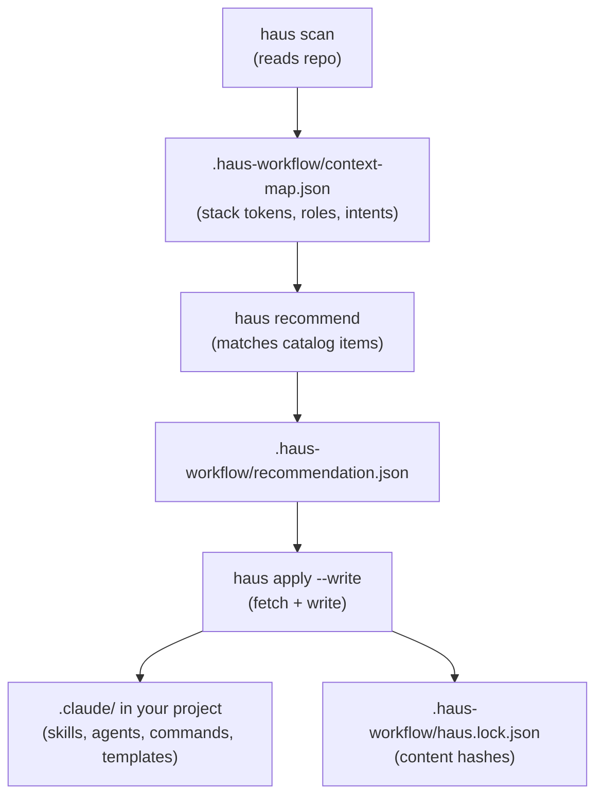
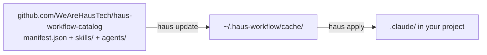
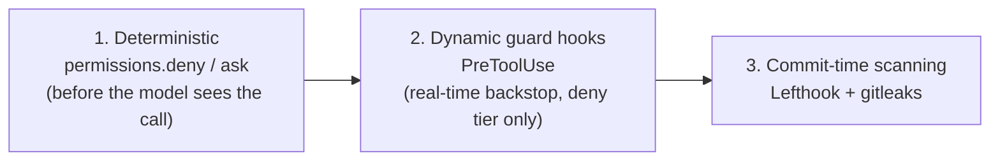

# Architecture

## The scan → recommend → apply pipeline

```mermaid
graph TD
  scan["haus scan\n(reads repo)"]
  context[".haus-workflow/context-map.json\n(stack tokens, roles, intents)"]
  recommend["haus recommend\n(matches catalog items)"]
  recommendation[".haus-workflow/recommendation.json"]
  apply["haus apply --write\n(fetch + write)"]
  dotclaude[".claude/ in your project\n(skills, agents, commands, templates)"]
  lock[".haus-workflow/haus.lock.json\n(content hashes)"]

  scan --> context
  context --> recommend
  recommend --> recommendation
  recommendation --> apply
  apply --> dotclaude
  apply --> lock
```

## Catalog fetch

Catalog items are **not** bundled into the npm package. They are fetched at runtime from [haus-workflow-catalog](https://github.com/WeAreHausTech/haus-workflow-catalog) and cached locally.

```mermaid
graph LR
  catalog["github.com/WeAreHausTech/haus-workflow-catalog\nmanifest.json + skills/ + agents/"]
  cache["~/.haus-workflow/cache/"]
  project[".claude/ in your project"]

  catalog -->|"haus update"| cache
  cache -->|"haus apply"| project
```

## Output ownership

haus-workflow writes exclusively to `.claude/` and `.haus-workflow/`. It never modifies application source code, package.json, or CI configuration.

Hand-edits inside haus-managed blocks (`<!-- HAUS:BEGIN … -->` … `<!-- HAUS:END … -->`) are overwritten on next `haus apply`. Edit source in the catalog; let apply propagate changes.

## Lock file

`.haus-workflow/haus.lock.json` records per-item content hashes. On `haus apply`:

- New items are fetched and written
- Changed items are updated (if the on-disk copy still matches the lock hash)
- Items dropped from the catalog are removed (if unmodified)
- User-edited copies are kept (hash mismatch = skip + warn)

## Security model

haus-workflow's guardrails act at three separate points in time, so no single failure leaves a project unprotected:

```mermaid
graph LR
  deny["1. Deterministic\npermissions.deny / ask\n(before the model sees the call)"]
  guard["2. Dynamic guard hooks\nPreToolUse\n(real-time backstop, deny tier only)"]
  commit["3. Commit-time scanning\nLefthook + gitleaks"]

  deny --> guard --> commit
```

### 1. Deterministic deny/ask rules

`haus install` / `apply` writes two managed permission arrays into `.claude/settings.json`:

- **`permissions.deny`** — hard-blocked automatically. Covers dangerous bash commands (`sudo`, `git push --force`, `drop database`, `npm publish`, …) and sensitive file patterns (`*.pem`, `*.key`, `id_rsa`, directories like `secrets/` or `customer-data/`).
- **`permissions.ask`** — Claude must prompt you before proceeding. Covers commands like `rm -rf` or `git reset --hard`, and paths like `.env` (Edit/Write only — Read is unrestricted) or `storage/logs/**`.

A scoped `permissions.allow` pre-approves haus's own subcommands (`haus doctor`, etc.) so you're not prompted on every routine step.

### 2. Dynamic guard hooks

`guard file-access` and `guard bash` are `PreToolUse` hooks that mirror the **deny tier only** — a real-time backstop in case the deterministic rule doesn't catch something first. Both return a plain-language reason naming the exact command or path that was blocked. A separate `decisions guard` hook (unrelated to security) blocks `gh pr create` when a diff needs an ADR it doesn't have.

### 3. Commit-time secret scanning

Projects that adopt the `haus.lefthook-security` catalog template get a pre-commit stage: gitleaks (when installed) plus an always-on grep baseline scanning newly-added lines for quoted-literal credential assignments. This catches secrets that make it past the two runtime layers above, before they ever reach a commit.

### What haus will never do

- Modify your application source, `package.json`, or CI configuration
- Scan or read files matched by its own sensitive-path denylist
- Silently widen your permissions — `apply --write` always re-enforces the canonical hooks and managed rules; opting out means uninstalling haus-managed settings, not a partial apply

See [Troubleshooting & FAQ](./troubleshooting) if `haus doctor --hooks` reports drift in any of this.
