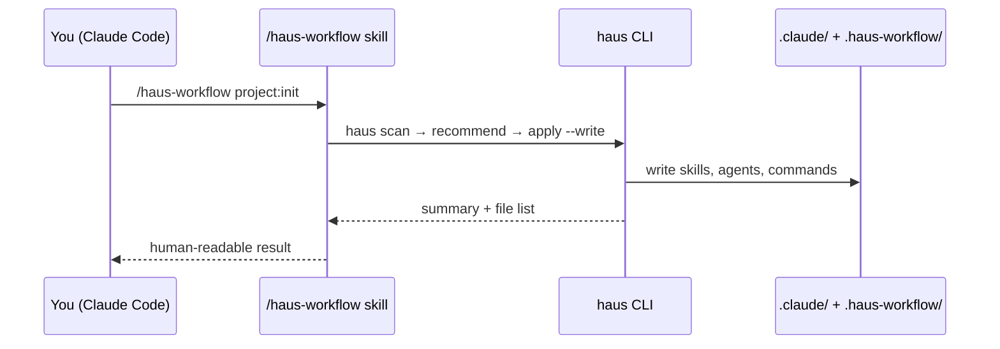

# Slash commands

After `npm install -g @haus-tech/haus-workflow`, Claude Code gains `/haus-workflow` — your in-chat interface to Haus Workflow without switching to the terminal.

:::tip Illustrated examples
See **[Claude Code in Action](../claude-code-guide)** for a chat mockup of every subcommand (menu, init, clone, cloneandsetup, refresh, doctor, update).
:::

## Command reference

| Command                                       | Description                             |
| :-------------------------------------------- | :-------------------------------------- |
| `/haus-workflow`                              | Interactive checkbox menu               |
| `/haus-workflow project:init`                 | Add Haus Workflow to this repo          |
| `/haus-workflow project:clone [name]`         | Clone from workspace manifest           |
| `/haus-workflow project:cloneandsetup [name]` | Clone + Node, deps, `.env`              |
| `/haus-workflow project:refresh`              | Refresh `.claude/` + CLAUDE.md imports  |
| `/haus-workflow project:doctor`               | Health check for drift                  |
| `/haus-workflow update`                       | Update package + catalog + `~/.claude/` |

Without an argument, the skill presents an interactive menu with checkbox options.

## When to use chat vs terminal

| Prefer slash command                    | Prefer `haus` in terminal         |
| :-------------------------------------- | :-------------------------------- |
| First-time project setup in Claude Code | CI scripts and automation         |
| Quick doctor / refresh while coding     | `haus workspace` multi-repo ops   |
| Update catalog between sessions         | `haus scan` with custom flags     |
| Explaining results in conversation      | `haus apply --dry-run` inspection |

## What happens under the hood

## Short aliases

Legacy short names still work: `/haus-setup`, `/haus-doctor`, `/haus-fix`, `/haus-clone`, `/haus-cloneandsetup`.
