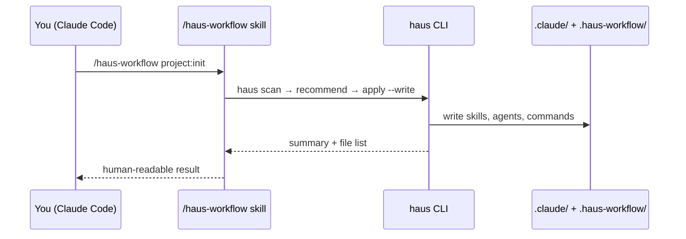

# Slash commands

After `npm install -g @haus-tech/haus-workflow`, Claude Code gains `/haus-workflow` — your in-chat interface to Haus Workflow without switching to the terminal.

:::tip Illustrated examples
See **[Claude Code in Action](/docs/haus-workflow/claude-code-guide)** for a chat mockup of every subcommand (menu, init, clone, cloneandsetup, refresh, doctor, add-skills).
:::

## Command reference

| Command                                       | Description                                         |
| :-------------------------------------------- | :-------------------------------------------------- |
| `/haus-workflow`                              | Interactive menu — pick a task                      |
| `/haus-workflow project:init`                 | Add Haus Workflow to this repo                      |
| `/haus-workflow project:reinit`               | Full re-setup from scratch (backs up first)         |
| `/haus-workflow project:clone [name]`         | Clone from workspace manifest                       |
| `/haus-workflow project:cloneandsetup [name]` | Clone + Node, deps, `.env`                          |
| `/haus-workflow project:add-skills`           | Add optional skills/agents/config not yet installed |
| `/haus-workflow project:refresh`              | Refresh `.claude/` + CLAUDE.md imports              |
| `/haus-workflow project:doctor`               | Health check for drift                              |
| `/haus-workflow project:fix`                  | Diagnose drift and apply the suggested fixes        |
| `/haus-workflow update`                       | Update package + catalog + `~/.claude/`             |
| `/haus-workflow install` / `uninstall`        | Seed or remove haus-owned files under `~/.claude/`  |
| `/haus-workflow help`                         | Explain tasks, no files touched                     |

Without an argument, the skill asks a couple of short questions to narrow down which task you want, then runs it.

## When to use chat vs terminal

| Prefer slash command                    | Prefer `haus` in terminal         |
| :-------------------------------------- | :-------------------------------- |
| First-time project setup in Claude Code | CI scripts and automation         |
| Quick doctor / refresh while coding     | `haus workspace` multi-repo ops   |
| Update catalog between sessions         | `haus scan` with custom flags     |
| Explaining results in conversation      | `haus apply --dry-run` inspection |

## What happens under the hood

```mermaid
sequenceDiagram
  participant you as You (Claude Code)
  participant skill as /haus-workflow skill
  participant cli as haus CLI
  participant repo as .claude/ + .haus-workflow/

  you->>skill: /haus-workflow project:init
  skill->>cli: haus scan → recommend → apply --write
  cli->>repo: write skills, agents, commands
  cli-->>skill: summary + file list
  skill-->>you: human-readable result
```

## Short aliases

Older Haus Workflow versions exposed separate `/haus-setup`, `/haus-doctor`, `/haus-fix`, `/haus-clone`, and `/haus-cloneandsetup` slash commands — these were removed in v1.0.0. Everything now routes through `/haus-workflow <task>`.

The short **task names** you pass to `/haus-workflow` still work as aliases, e.g. `/haus-workflow setup`, `/haus-workflow doctor`, `/haus-workflow fix`, `/haus-workflow clone` — see the [command reference](#command-reference) above.
